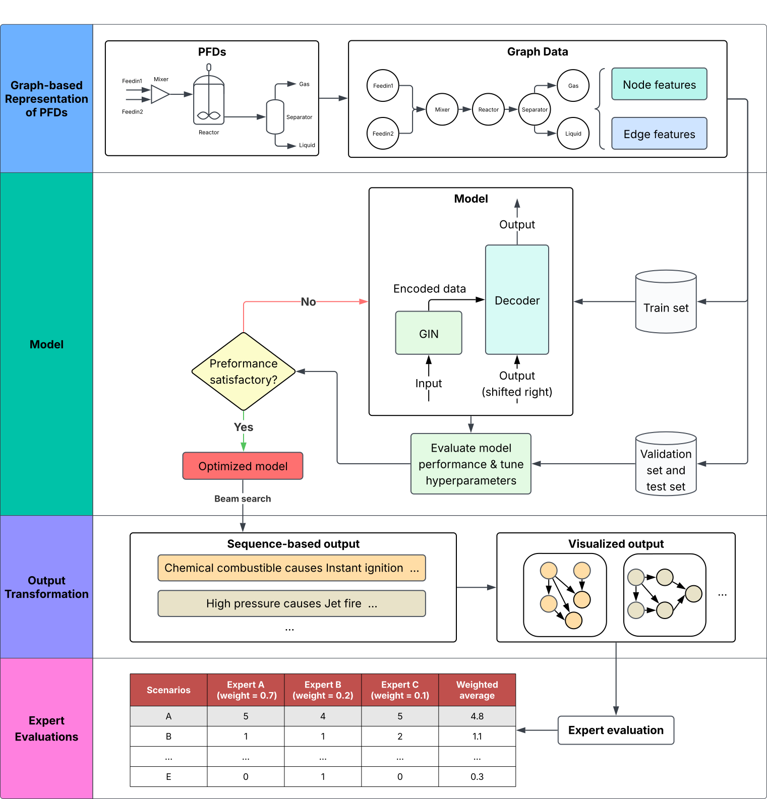

## Introduction

Implementation for AI-driven method for exhaustive hazard scenario generation in chemical process systems

<!--  -->



## install

```bash
conda env create -f environment.yml
conda activate graphdecoder
```

## Dataset

This dataset was generated based on rule-based logic. The input and output are built independently using different scripts.
You can access the processed dataset and pre-trained model weights via the following Google Drive link:
https://drive.google.com/drive/folders/1-l79eFNjTlllNm4z0sQ9jAv7sgOAJ9_p?usp=sharing

### Input

- `data_forming.ipynb`: Generates node features for Process Flow Diagrams (PFDs).  
  These features serve as the structural input for downstream tasks.

### Output

- Hazard scenarios are created using **yEd Graph Editor** and saved in `total.graphml`.
- `json_generate.ipynb`: Reads `total.graphml` and converts the scenarios into structured JSON format, saved as `graph_relations_labeled_structured.json`.

### Integration

- `data_preprocess.ipynb`: Combines the input features and output scenarios into a unified binary file `graph_data.bin`.  
  This file serves as the dataset for model training, validation, and testing.


## Usage 

### Running with VS Code (Using launch.json)

This project includes a pre-configured `.vscode/launch.json` file that defines several run/debug configurations for Visual Studio Code.

### To use these:

1. Click the **Run and Debug** icon on the sidebar (or press `Ctrl+Shift+D`).
2. In the dropdown at the top of the panel, choose one of the available configurations, such as:  
   - `Run Generate_case_study Module`  
   - `Run Main (Train)`  
3. Click the **▶ Run** button or press `F5`.

## Acknowledgments 

The authors thankfully acknowledge the financial support provided by the Mary Kay O’Connor Process Safety Centre at Texas A&M University. 
